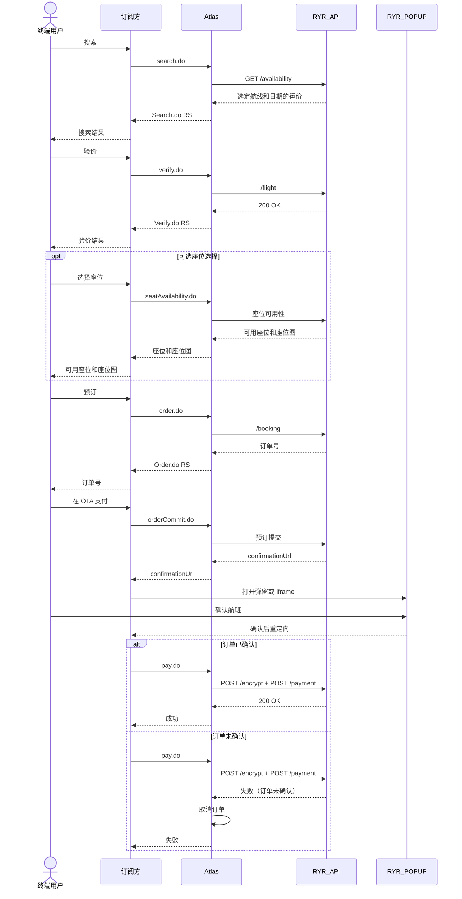

# FR 集成


💬 **需要帮助？** 如果遇到问题，请在帮助中心咨询 Eva，快速获取诊断建议。

<a href="https://www.atriptech.com/" class="button primary" data-icon="comments">咨询 Eva</a>


当您集成瑞安航空（FR）预订流程时使用此页面。

### 何时使用此流程

在以下情况下使用 FR 流程：

* 航司代码为 FR
* 最终支付前需要订单确认
* 需要弹窗或 iframe 确认
* 适用瑞安航空特定的展示和儿童座位规则

### FR 与标准流程的区别

与常规预订流程相比，FR 增加了额外要求：

* 运价和附加服务费用的价格透明度
* 在 FR 确认页面上获取明确的乘客同意
* 支付前必须执行 `orderCommit.do` 步骤
* 儿童座位场景的特殊处理
* FR 特定的 UAT 和 IP 白名单

### FR 工作流图

此流程在 `order.do` 和 `pay.do` 之间增加了一个 FR 确认页面。

### FR 预订流程




### 搜索

调用 [搜索](/api-wen-dang/product-guides/booking/booking-step-guides/search.md) 并保存选定的 `routingIdentifier`。




### 验价

调用 [验价](/api-wen-dang/product-guides/booking/booking-step-guides/verify.md) 并保存返回的 `sessionId`。




### 可选座位选择

如果您支持 FR 座位选择，请在预订前调用 [座位](/api-wen-dang/product-guides/booking/optional-ancillaries/seats-and-baggage.md)。

如果您使用 FR 儿童座位简化方案，请跳过此步骤。




### 创建订单

使用乘客信息、联系方式和所需的 FR 字段调用 [创建订单](/api-wen-dang/product-guides/booking/booking-step-guides/create-order.md)。

确保订单请求包含：

* 乘客邮箱
* 订阅方邮箱
* 订阅方公司名称（在 `clientContact` 中）
* `locale`
  



### 收款并提交订单

在此阶段，OTA 向用户收款。\
请**不要**调用 `pay.do`。

然后调用 [确认订单](/api-wen-dang/product-guides/booking/booking-step-guides/confirm-order.md)。

Atlas 返回 `confirmationUrl`，用于弹窗模式或 iframe 模式。




### 用户在 FR 页面确认

向用户展示 `confirmationUrl`。

FR 确认页面包含所需的条款与条件以及同意复选框。用户必须在出票前完成此步骤。




### 支付与出票

仅在用户完成确认后，调用 [支付与出票](/api-wen-dang/product-guides/booking/booking-step-guides/payment-and-ticketing.md)。

支付可使用 `VCC` 或 `Deposit`。




### 轮询最终状态

使用 [查询订单](/api-wen-dang/product-guides/booking/booking-step-guides/query-order.md) 直到 `orderStatus=2` 且 `ticketStatus=0`。



### 确认订单模式

#### 弹窗模式

发送订单号和一个 `redirectUri`。\
Atlas 返回 `confirmationUrl`。\
将终端用户重定向到该页面。

准备一个重定向页面 URL 并与 Atlas 共享。\
该页面应接受 `AtlasOrderNumber` 作为输入参数。

用户确认后，FR 将用户重定向回您的 `redirectUri`。

#### Iframe 模式

发送订单号并设置 `iframe=true`。\
Atlas 返回 `confirmationUrl`。\
在您的 iframe 流程中展示该页面。

在 iframe 模式下，`redirectUri` 将被忽略。

### 支付时机规则

在订单确认完成之前，不要调用 `pay.do`。

如果用户在订单创建后 30 分钟内未确认：

* 订单状态变为 `Expired`（已过期）
* Atlas 不会出票
* 如已收款，OTA 应向终端用户退款

如果在用户完成 FR 确认之前尝试调用 `pay.do`，航司支付可能失败，订单可能被取消。

### 必需的 FR 业务规则

#### 价格透明度

将航司运价与以下费用分开展示：

* 航司支付手续费
* Atlas 服务费
* 订阅方加价
* 附加服务费用

从搜索和验价响应中的 `cardChargeList` 读取支付手续费数据。

确保用户能够清晰识别 Ryanair 的实际价格。

#### 乘客同意

FR 确认页面必须收集用户对以下内容的同意：

* 服务条款
* 隐私政策
* Cookie 政策
* myRyanair 账户确认

#### 联系信息

同时提供：

* 乘客邮箱
* 订阅方邮箱和公司名称（在 `clientContact` 中）
* 必需的预订 `locale`

这有助于确保双方都能收到航司通知。

有关支持的 locale 值，请参阅 [语言环境参考](/api-wen-dang/support-and-reference/integration-reference/reference-data/locale.md)。

### 儿童座位规则

当包含 12 岁以下儿童时，FR 适用特殊规则。

#### 重要行为

* 每位成人最多携带 4 名儿童
* 至少一名成人可能需要付费座位
* 儿童必须与陪同成人坐在同一排
* 支付前座位选择可能变为强制要求

#### Atlas 简化选项

如果您尚未准备好支持 FR 带儿童的全量座位选择逻辑：

1. 禁用座位选择
2. 收取强制性座位费
3. 让 Atlas 自动分配第一名成人和儿童的座位

使用搜索和验价响应中的 `childMandatorySeatingFee`。

同时确保每个预订中儿童数量不超过 4 名。


如果您的 FR 儿童座位处理尚未就绪，请在支持完成前阻止 FR 儿童预订。


### UI 指导

推荐最大宽度：

* 弹窗：`1028px`
* iframe：`1028px`

建议的桌面/移动端断点：

* `768px`

### UAT 要求

#### IP 白名单

在开始实时 FR 预订测试之前，提供静态 IP 地址用于 Ryanair 白名单。

#### FR 沙箱 VCC 测试卡

| 卡号               | 类型            |
| ---------------- | ------------- |
| 5200000000002235 | Mastercard，批准 |
| 4000000000002701 | Visa，批准       |
| 5476850000000002 | 拒绝卡           |
| 5100000014101198 | 拒绝卡           |

使用拒绝卡验证支付失败处理。


不要在测试环境中使用真实卡。


#### FR 测试航线

* `DUB-KIR`
* `KIR-DUB`
* `DUB-LON`
* `LON-DUB`
* `MAN-DUB`
* `DUB-MAN`

#### UAT 场景

使用下面的 FR 特定 UAT 文件。



### 相关页面

* [确认订单](/api-wen-dang/product-guides/booking/booking-step-guides/confirm-order.md)
* [支付与出票](/api-wen-dang/product-guides/booking/booking-step-guides/payment-and-ticketing.md)
* [UAT 提交流程](/api-wen-dang/readme-1/uat-submission-guide.md)
* [特殊集成](/api-wen-dang/product-guides/extensions-and-integrations/special-integrations.md)
